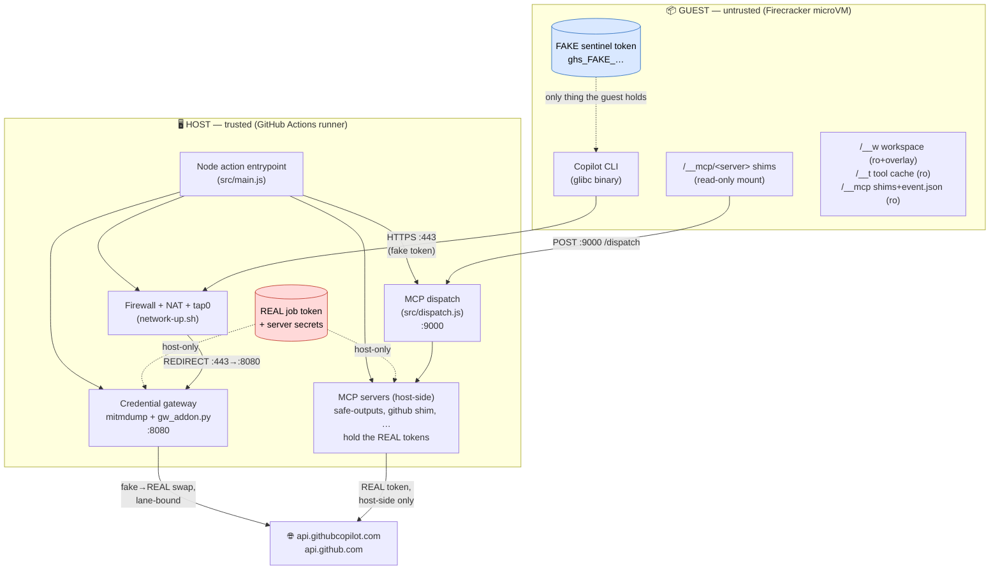
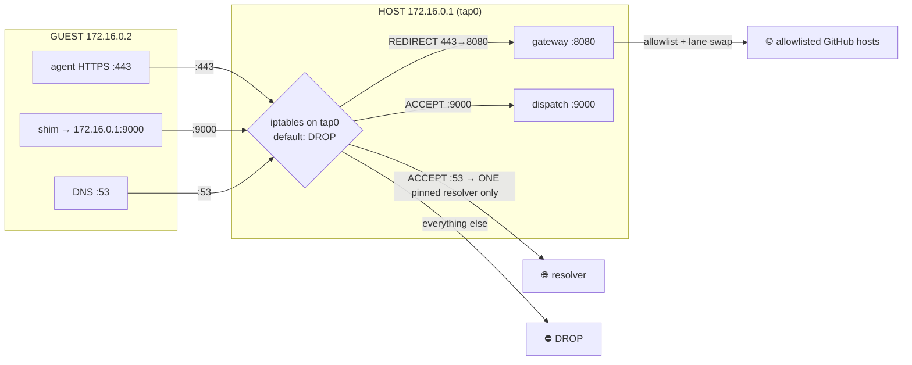
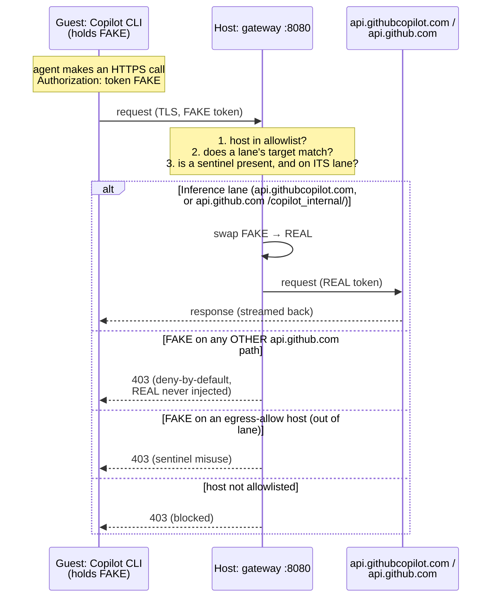
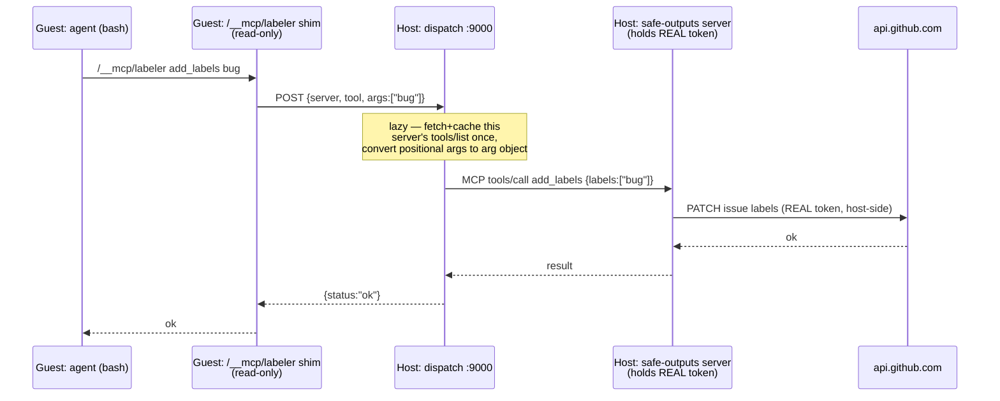
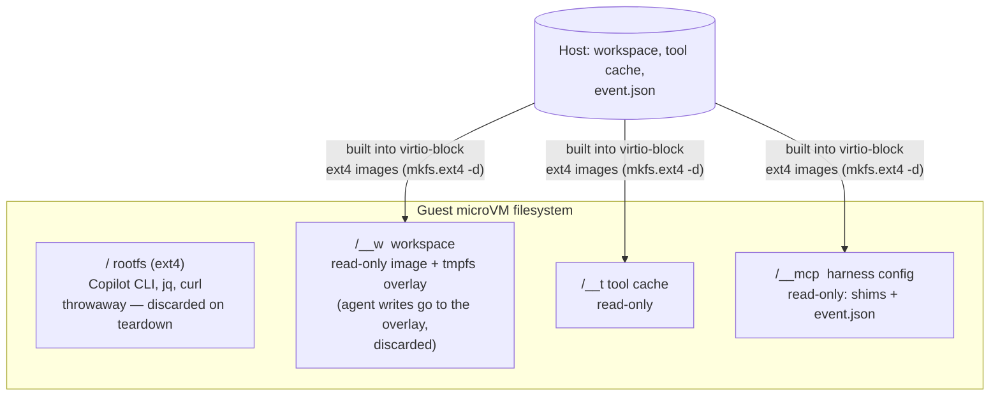
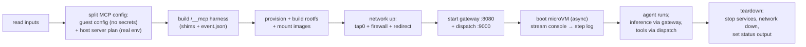

# microvm-agent — architecture & security model

This document explains how `microvm-agent` runs an AI agent (the Copilot CLI) inside a
Firecracker microVM **without ever placing a real credential inside the sandbox**, and
how it lets the agent reach GitHub/Copilot and apply narrowly-scoped writes anyway.

If you only read one thing: **the guest is untrusted.** Every secret, every policy
decision, and every write-capable credential lives on the **host**. The guest holds only
fake sentinel tokens and thin forwarder shims. Even a fully-compromised agent cannot read
a real token or escalate to a write API.

---

## 1. Trust boundary (component view)

**The line down the middle is the security boundary.** Nothing red (real credentials)
ever crosses into the guest. The guest reaches the outside world only through two
host-controlled choke points: the **gateway** (for the agent's own HTTPS) and the
**dispatch** (for MCP tool calls).

---

## 2. Two lanes out of the sandbox

The guest can talk to exactly two host services. Everything else is dropped.

| Lane | Guest side | Host side | What crosses | Credential |
|------|-----------|-----------|--------------|------------|
| **Inference** | Copilot CLI → HTTPS `:443` | Gateway `:8080` (mitmproxy) | Copilot inference + built-in read-only github MCP | Guest sends **fake**; gateway swaps to **real** only on the bound lane |
| **MCP tools** | `/__mcp/<server>` shim → `POST :9000` | Dispatch `:9000` → host-side MCP server | Tool calls (safe outputs, github shim) | Guest sends **no token**; the **real** token is used host-side by the server |

Key property: the **write-scoped** job token is used **only** by host-side MCP servers
(lane 2). The guest never holds it and can never reach it.

---

## 3. Network & firewall (how egress is pinned)

- Firewall is enforced on the **host** `tap0` device (`network-up.sh`), so **in-guest root
  cannot lift it**. Default policy is DROP.
- All guest `:443` is **REDIRECTed to the gateway** — the guest has no way to bypass it or
  reach `:443` directly. The gateway is therefore *unbypassable*.
- DNS `:53` is pinned to a **single resolver** (decision B) — otherwise DNS is a
  tunnel/exfil channel needing no token.
- Only `:9000` (dispatch) and the pinned `:53` are otherwise allowed out.

---

## 4. The credential gateway (mitmproxy) — what it is & why

**mitmproxy** (`mitmdump`, run **host-side**) is a TLS-intercepting forward proxy: it holds
a CA the guest trusts, so it can terminate the guest's TLS, inspect/modify the plaintext
request, then re-encrypt to the real upstream. Our addon (`scripts/gw_addon.py`) makes it
the **credential gateway**.

### Per-lane sentinel↔credential binding (decision A)

The real credential is swapped in **only** on its lane's `host [+ path prefix]`. A guest
`curl api.github.com/repos/…` carrying the fake token gets a **403 with no swap** — it
cannot turn the sentinel into the write-scoped job token. (Empirically confirmed: in a real
run the real token was injected only on `api.githubcopilot.com`; zero swaps on
`api.github.com`.)

> **Why a MITM proxy at all?** So the guest can *use* a credential it never *holds*. The
> real token exists only inside the host gateway; the sandbox sees only a fake. This is the
> core of the "credentials stay host-side" guarantee.

---

## 5. MCP tools — host-side servers, guest-side shims

Non-default MCP servers can't run natively in the guest (the Copilot CLI blocks them when
the MCP registry policy 403s with an Actions token — see TODO). So **every** MCP server
runs **host-side**; the guest gets only thin **forwarder shims**. This is both the policy
workaround and security-aligned: servers + their secrets never enter the sandbox.

- **One shim per server** at `/__mcp/<server>`, invoked `<server> <tool> <args>`.
- Shims are delivered via a **read-only mount** (`/__mcp`) — tamper-proof
  (hypervisor-enforced), off `$PATH`, not baked into the rootfs.
- **Lazy discovery**: no startup `tools/list`; the dispatch fetches + caches a server's
  tools on first use. The prompt preamble lists the servers + "run `<server> --help`".
- The real token for each server stays host-side in the server's process env.

---

## 6. Guest filesystem & mounts

- Well-known guest paths mirror the Actions container-job convention: workspace → `/__w`,
  tool cache → `/__t` (with `GITHUB_WORKSPACE` / `RUNNER_TOOL_CACHE` set to match). **No
  host-path mirroring** — the guest never sees real host paths.
- Workspace is a **read-only lower + throwaway tmpfs overlay**: the agent can write, but
  changes are discarded. **Persisting anything happens only via safe outputs** (lane 2).
- Only the single `event.json` is injected (via `/__mcp`, surfaced as
  `GITHUB_EVENT_PATH`) — never `RUNNER_TEMP` (which holds the checkout push token).

---

## 7. End-to-end lifecycle (what `main.js` orchestrates)

The boot is **async** (`spawn`, not `execFileSync`): the dispatch server lives in the same
Node process and must keep its event loop free to answer the guest's shim calls **while the
VM is running**.

---

## 8. Security invariants (the short list)

1. **No real credential in the guest** — only fake sentinels; the gateway swaps host-side.
2. **Lane-bound swap** — the real token is injected only on its allowlisted host/path; every
   other `api.github.com` path is deny-by-default (no write escalation).
3. **Write token is host-only** — used solely by host-side MCP servers; unreachable from the
   guest.
4. **Unbypassable egress** — host firewall forces all `:443` through the gateway; default
   DROP; DNS pinned to one resolver.
5. **Tamper-proof injected assets** — shims/event.json ride a hypervisor read-only mount.
6. **No persistence except via safe outputs** — workspace writes hit a throwaway overlay.
7. **Guest controls nothing about a trusted lane** — not the URL, not the credential, not
   its scope (the "ceiling principle", decision A).

---

*Source of truth for the finalized decisions (A–F): `TODO.md` → "Design decisions".*
