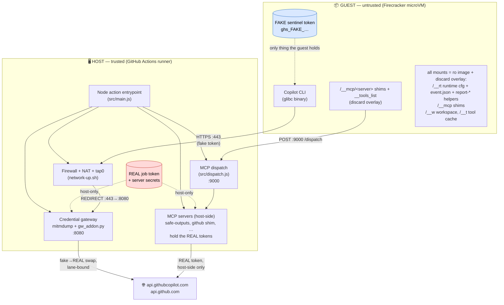
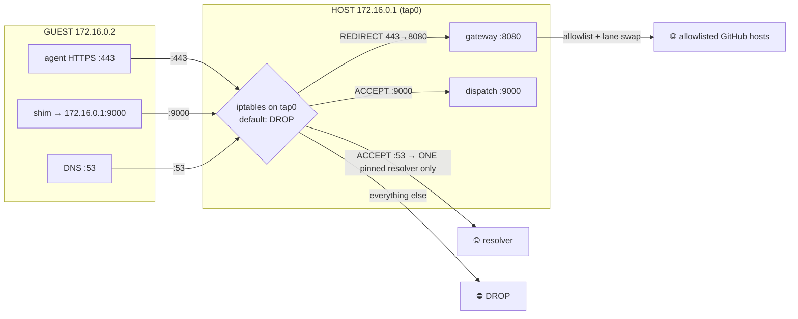
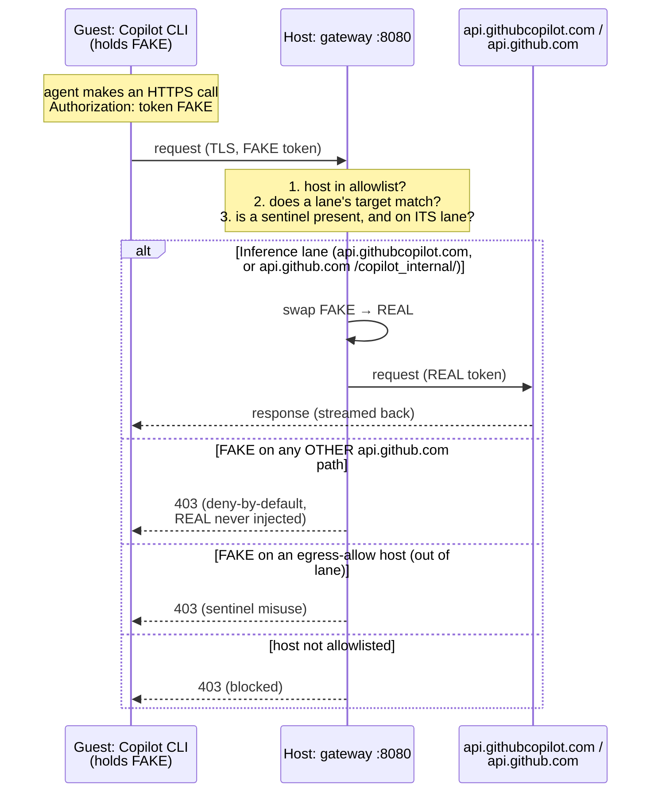
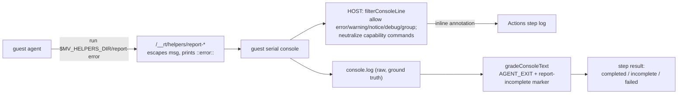
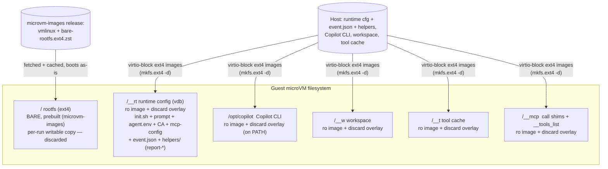

# microvm-agent — architecture & security model

This document explains how `microvm-agent` runs an AI agent (the Copilot CLI) inside a
Firecracker microVM **without ever placing a real credential inside the sandbox**, and
how it lets the agent reach GitHub/Copilot and apply narrowly-scoped writes anyway.

If you only read one thing: **the guest is untrusted.** Every secret, every policy
decision, and every write-capable credential lives on the **host**. The guest holds only
fake sentinel tokens and thin forwarder shims. Even a fully-compromised agent cannot read
a real token or escalate to a write API.

---

## 1. Trust boundary (component view)

**The line down the middle is the security boundary.** Nothing red (real credentials)
ever crosses into the guest. The guest reaches the outside world only through two
host-controlled choke points: the **gateway** (for the agent's own HTTPS) and the
**dispatch** (for MCP tool calls).

---

## 2. Two lanes out of the sandbox

The guest can talk to exactly two host services. Everything else is dropped.

| Lane | Guest side | Host side | What crosses | Credential |
|------|-----------|-----------|--------------|------------|
| **Inference** | Copilot CLI → HTTPS `:443` | Gateway `:8080` (mitmproxy) | Copilot inference + built-in read-only github MCP | Guest sends **fake**; gateway swaps to **real** only on the bound lane |
| **MCP tools** | `/__mcp/<server>` shim → `POST :9000` | Dispatch `:9000` → host-side MCP server | Tool calls (safe outputs, github shim) | Guest sends **no token**; the **real** token is used host-side by the server |

Key property: the **write-scoped** job token is used **only** by host-side MCP servers
(lane 2). The guest never holds it and can never reach it.

---

## 3. Network & firewall (how egress is pinned)

- Firewall is enforced on the **host** `tap0` device (`network-up.sh`), so **in-guest root
  cannot lift it**. Default policy is DROP.
- All guest `:443` is **REDIRECTed to the gateway** — the guest has no way to bypass it or
  reach `:443` directly. The gateway is therefore *unbypassable*.
- DNS `:53` is pinned to a **single resolver** (decision B) — otherwise DNS is a
  tunnel/exfil channel needing no token.
- Only `:9000` (dispatch) and the pinned `:53` are otherwise allowed out.

---

## 4. The credential gateway (mitmproxy) — what it is & why

**mitmproxy** (`mitmdump`, run **host-side**) is a TLS-intercepting forward proxy: it holds
a CA the guest trusts, so it can terminate the guest's TLS, inspect/modify the plaintext
request, then re-encrypt to the real upstream. Our addon (`scripts/gw_addon.py`) makes it
the **credential gateway**.

### Per-lane sentinel↔credential binding (decision A)

The real credential is swapped in **only** on its lane's `host [+ path prefix]`. A guest
`curl api.github.com/repos/…` carrying the fake token gets a **403 with no swap** — it
cannot turn the sentinel into the write-scoped job token. (Empirically confirmed: in a real
run the real token was injected only on `api.githubcopilot.com`; zero swaps on
`api.github.com`.)

> **Why a MITM proxy at all?** So the guest can *use* a credential it never *holds*. The
> real token exists only inside the host gateway; the sandbox sees only a fake. This is the
> core of the "credentials stay host-side" guarantee.

---

## 5. MCP tools — host-side servers, guest-side shims

Non-default MCP servers can't run natively in the guest (the Copilot CLI blocks them when
the MCP registry policy 403s with an Actions token — see TODO). So **every** MCP server
runs **host-side**; the guest gets only thin **forwarder shims**. This is both the policy
workaround and security-aligned: servers + their secrets never enter the sandbox.

- **One shim per server** at `/__mcp/<server>`, a pure passthrough invoked
  `<server> <tool> --input '<JSON>' | --stdin`.
- Shims ride a **discard overlay** (RO host image + throwaway tmpfs) — the host image
  stays pristine while the guest may write; off `$PATH`, not baked into the rootfs. (Shim
  read-only-ness isn't a security control — the guest can bypass a shim; the boundary is
  host-side dispatch/gateway.)
- **Discovery** relays `tools/list` via the reserved `/__mcp/__tools_list` command; the
  dispatch fetches + caches a server's
  tools on first use. The prompt preamble lists the servers + "run `<server> --help`".
- The real token for each server stays host-side in the server's process env.
- The prompt preamble references servers and helpers through the well-known env vars
  `$MV_MCP_DIR` (the shims dir) and `$MV_HELPERS_DIR` (see §6) — never a hardcoded path,
  so the actual dir names can change freely.

---

## 6. Agent diagnostics, error surfacing & result model

The agent needs to (a) surface problems **inline** in the Actions log and (b) declare
whether it actually finished — the Actions-native way, without ever hand-formatting a
fragile `::workflow command::` or holding any host capability.

- **Guest-side helper scripts.** `report-error`, `report-warning`, `report-notice`, and
  `report-incomplete` live off-PATH in `/__rt/helpers` (surfaced as `$MV_HELPERS_DIR`).
  Each takes the raw message as an arg and does the workflow-command escaping itself
  (`%`→`%25`, CR→`%0D`, LF→`%0A`), then prints e.g. `::error::<escaped>`. The agent runs
  `"$MV_HELPERS_DIR/report-error" "…"` — it never formats the command (the fragile part
  `core.error()` does host-side) and holds no host capability. Delivered per-run on the
  `/__rt` mount (a discard overlay), granted via `--add-dir`; not baked into the rootfs, not on PATH.
- **Untrusted console → stdout allowlist filter.** The guest serial console is streamed to
  the step log, but the runner interprets *any* `::command::` on stdout — so a compromised
  guest could inject `::set-output::`, `::add-path::`, `::stop-commands::`, etc. `bootVm`
  runs firecracker `silent` and re-emits the console line-by-line through `filterConsoleLine`
  (`src/console-filter.js`): only informational annotations
  (`error`/`warning`/`notice`/`debug`/`group`/`endgroup`) pass **verbatim** (so agent errors
  show inline), and every other `::…::` is neutralized. The raw console is captured
  separately for grading.
- **Result model (three layers).** Actions grades a step from the **exit code of the host
  process** (`node dist/index.js`), not the guest agent — there is no `::set-result::`. The
  guest agent's exit code surfaces via the console (`=== GUEST: AGENT_EXIT=$? ===`), and
  `gradeConsoleText` grades: (1) never reached the agent → **failed**; (2) `report-incomplete`
  marker present → **incomplete** (ran fine but couldn't achieve the task); (3) `AGENT_EXIT`
  non-zero or missing → **failed**, exactly `0` → **completed**. Anything non-completed →
  `core.setFailed()`.

---

## 7. Guest filesystem & mounts

- The rootfs is a **prebuilt bare image** fetched from `microvm-images` (pinned kernel + rootfs) and
  cached; the action boots a **per-run sparse copy** so the cache stays pristine. Nothing run-specific
  is baked in — it rides the mounts.
- Well-known guest paths mirror the Actions container-job convention: workspace → `/__w`, tool cache →
  `/__t` (with `GITHUB_WORKSPACE` / `RUNNER_TOOL_CACHE` set to match). **No host-path mirroring.**
- **Every mount uses a read-only host image + throwaway tmpfs discard overlay** (and the
  rootfs is writable) — so a tool can write into any directory and never fail, but nothing
  persists and the underlying host images stay pristine. This includes the `/__mcp` shims
  and the `/__rt` runtime config (incl. `event.json` and the `report-*` helpers): they are
  writable-but-discarded, not purely read-only. Shim/asset read-only-ness is **not** a
  security control (the guest can bypass a shim; the boundary is host-side). **Persisting
  anything happens only via safe outputs** (lane 2).
- The Copilot CLI is **mounted** at `/opt/copilot` (on PATH), not baked into the rootfs — so the base
  image is generic and cacheable. Contract for a custom `rootfs`: **x86_64 + glibc ≥ 2.28 +
  libstdc++.so.6** (preflighted; musl/Alpine unsupported).
- Only the single `event.json` is injected (via `/__rt`, surfaced as `GITHUB_EVENT_PATH`) — never
  `RUNNER_TEMP` (which holds the checkout push token). `/__rt` is granted to the CLI via `--add-dir`
  (all non-secrets: fake token, public CA, prompt, no-secret mcp-config) so it can read `event.json` and
  run the `report-*` helpers.

---

## 8. End-to-end lifecycle (what `main.js` orchestrates)

```mermaid
flowchart LR
  I["read inputs"] --> P["split MCP config:<br/>guest config (no secrets)<br/>+ host server plan (real env)"]
  P --> B["build mounts:<br/>/__mcp shims + /__rt cfg<br/>(event.json + report-* helpers)"]
  B --> R["provision + build rootfs<br/>+ mount images"]
  R --> N["network up:<br/>tap0 + firewall + redirect"]
  N --> S["start gateway :8080<br/>+ dispatch :9000"]
  S --> V["boot microVM (async)<br/>stream console → step log"]
  V --> A["agent runs;<br/>inference via gateway,<br/>tools via dispatch"]
  A --> T["teardown:<br/>stop services, network down,<br/>set status output"]
```

The boot is **async** (`spawn`, not `execFileSync`): the dispatch server lives in the same
Node process and must keep its event loop free to answer the guest's shim calls **while the
VM is running**.

---

## 9. Security invariants (the short list)

1. **No real credential in the guest** — only fake sentinels; the gateway swaps host-side.
2. **Lane-bound swap** — the real token is injected only on its allowlisted host/path; every
   other `api.github.com` path is deny-by-default (no write escalation).
3. **Write token is host-only** — used solely by host-side MCP servers; unreachable from the
   guest.
4. **Unbypassable egress** — host firewall forces all `:443` through the gateway; default
   DROP; DNS pinned to one resolver.
5. **Host images stay pristine; nothing persists** — every mount (shims, runtime config,
   workspace, tool cache, Copilot) is a read-only host image + throwaway tmpfs discard
   overlay, so the guest may write anywhere but writes are discarded. (Asset read-only-ness
   is not itself a security control — the boundary is host-side.)
6. **No persistence except via safe outputs** — all guest writes hit throwaway overlays.
7. **Guest controls nothing about a trusted lane** — not the URL, not the credential, not
   its scope (the "ceiling principle", decision A).
8. **Untrusted console is filtered** — the guest cannot inject capability workflow commands;
   the host stdout allowlist passes only informational annotations to the step log (§6).

---

*Source of truth for the finalized decisions (A–F): `TODO.md` → "Design decisions".*
